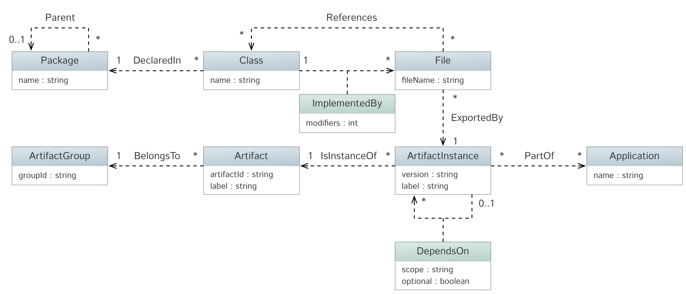

dependency-grapher
==================

Quick hack to add maven dependency trees and the intra-class dependencies to a graph database.

It resolves all (runtime) maven dependencies, downloads the artifacts. All jar-files get inspected and any class files inside are read to find references to other classes.
It then stores the dependency hierarchy, artifact contents and intra-class dependencies into an OrientDB graph.

The graph created follows this structure:

Build using:

    $ ./gradlew installDist

An executable will be generated in `dependency-grapher-cli/build/install/dependency-grapher-cli/bin` and can be invoked like so:

    $ ./dependency-grapher-cli config.yml

*Note:* It will happily delete any database with the name you specify in the configuration before filling it with data if it can.

Config example:

    database:
      connector: "orientdb"
      url: "remote:127.0.0.1/test"
      username: "root"
      password: "correct horse battery staples"
    resolver:
      localRepository:
        location: "/tmp/grapher-repo"
      remoteRepositories:
        - id: "Central"
          contentType: "default"
          location: "http://repo1.maven.org/maven2/"
    applications:
    - name: "spring-orm"
      artifacts:
      - "org.springframework:spring-orm:4.2.0.RELEASE"

Sample queries
--------------

Here are some queries to try out

Number of classes per artifact:

    SELECT label, $x, $y
    FROM ArtifactInstance
    LET $x=in_ExportedBy.out.in_ImplementedBy.out,
        $y=$x.size()
    ORDER BY $y ASC

Referenced classes with no implementation in the dependency tree:

    SELECT name
    FROM Class
    WHERE out_ImplementedBy.in IS NULL

Classes with multiple implementations:

    SELECT name, $implementations.label
    FROM Class
    LET $implementations = out_ImplementedBy.in.out_ExportedBy.in
    WHERE coalesce($implementations.size(), 0) > 1
    ORDER BY name ASC

What's next?
------------

Some things I want to do, but probably won't because that's usually how it goes :)

* Figure out a good name for the project
* Add interesting queries to the list above
  - Find artifacts with no incoming class references
  - Find artifacts
* Add some UI that enables navigation and visualization of the dependencies as well as showing information about potential problems.
* Add server functionality to perform and present analysis as part of a CI process.
* Add more reference meta-data such that the type of reference (inheritance, field, local var, parameter) can be included.
* Add support for writing the data into Neo4J to evaluate the differences
* Add ability to merge data sets from existing data
* Compare the structure of multiple versions

Patches and ideas are welcome!

License
-------

This software is licensed under the [ISC](http://opensource.org/licenses/ISC) license:

    Copyright (c) 2015 Henrik Gustafsson <henrik.gustafsson@fnord.se>

    Permission to use, copy, modify, and distribute this software for any
    purpose with or without fee is hereby granted, provided that the above
    copyright notice and this permission notice appear in all copies.

    THE SOFTWARE IS PROVIDED "AS IS" AND THE AUTHOR DISCLAIMS ALL WARRANTIES
    WITH REGARD TO THIS SOFTWARE INCLUDING ALL IMPLIED WARRANTIES OF
    MERCHANTABILITY AND FITNESS. IN NO EVENT SHALL THE AUTHOR BE LIABLE FOR
    ANY SPECIAL, DIRECT, INDIRECT, OR CONSEQUENTIAL DAMAGES OR ANY DAMAGES
    WHATSOEVER RESULTING FROM LOSS OF USE, DATA OR PROFITS, WHETHER IN AN
    ACTION OF CONTRACT, NEGLIGENCE OR OTHER TORTIOUS ACTION, ARISING OUT OF
    OR IN CONNECTION WITH THE USE OR PERFORMANCE OF THIS SOFTWARE.

